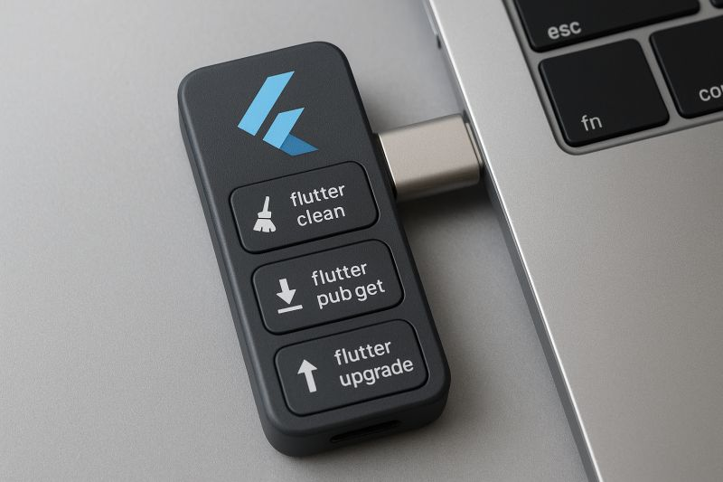
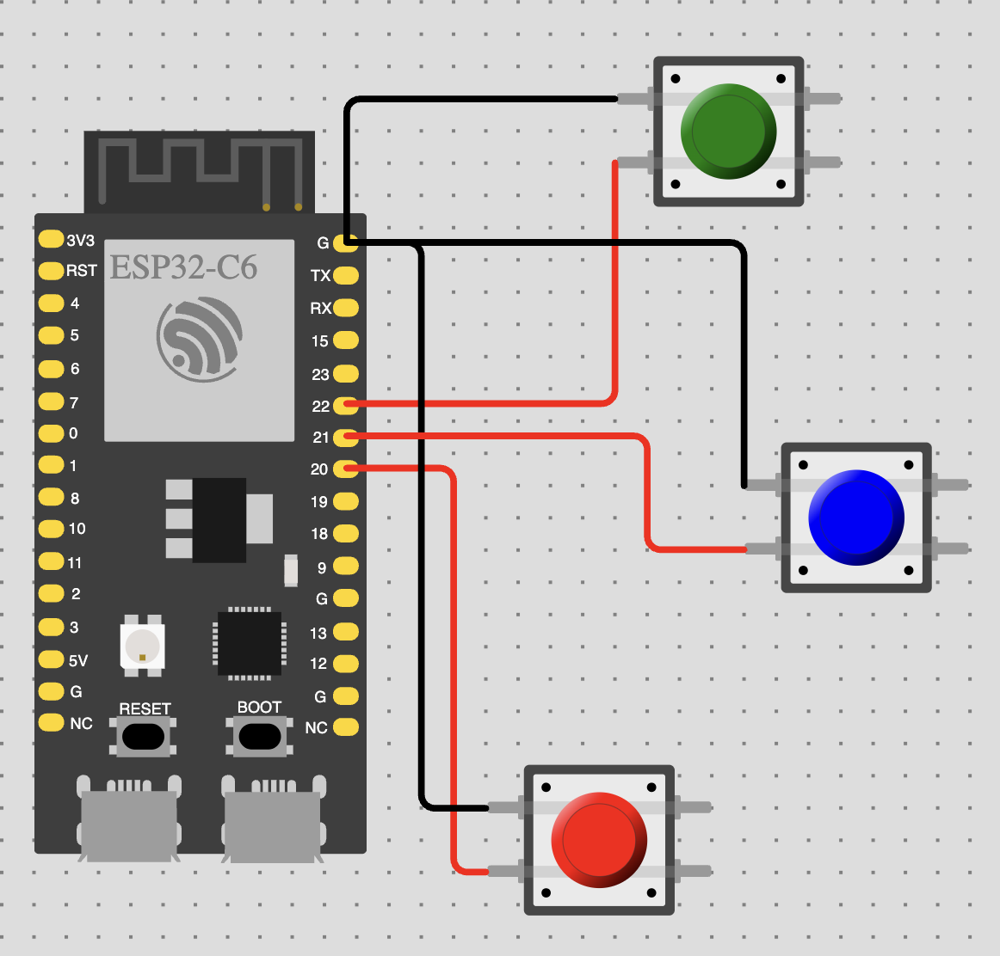

# Flutter Gadget — Hardware Buttons for Your Flutter Workflow 🚀

Tired of typing `flutter clean`, `flutter pub get`, or `flutter upgrade` every time?
With this little **ESP32/Arduino gadget**, you can map **physical buttons** to your Flutter commands.
Press a button on the device → the command runs instantly on your computer. ⚡

<p align="center">
  
</p>

---

## ✨ Features
- 🖱️ **Physical buttons** trigger Flutter commands
- 🖥️ **Cross-platform Python daemon** (macOS, Linux, Windows)
- 🔌 **Auto-detects serial port**
- ✅ **Token validation** (only recognized commands are executed)
- 🔧 Built with **Arduino IDE / ESP32** firmware + **Python script**

---

## 🖼️ Circuit
<p align="center">
  
</p>

---

## 📂 Project Structure
```
firmware/
  esp32_flutter_keys/
    esp32_flutter_keys.ino # ESP32/Arduino firmware
daemon/
  main.py                  # Python cross-platform daemon
  requirements.txt         # Python dependencies
```

---

## ⚙️ How It Works

### 1. ESP32 / Arduino Firmware
- Written in **C++ (Arduino IDE)**
- Uses `INPUT_PULLUP` buttons on GPIOs
- On press, sends a short **token** via Serial:
  - `CLEAN` → `flutter clean`
  - `PUBGET` → `flutter pub get`
  - `UPGRADE` → `flutter upgrade`

👉 Flash the firmware using [Arduino IDE](https://www.arduino.cc/en/software) (choose ESP32 board or Arduino board).
👉 On the ESP32 C6, recommended pins are **20 / 21 / 22** (safe GPIOs).

👉 Online project on Wokwi:
https://wokwi.com/projects/440295324580074497

---

### 2. Python Daemon
- Listens on the serial port
- Validates incoming tokens
- Executes the matching **Flutter command** in your project directory

Requirements:
```bash
# Create and activate virtual environment
python3 -m venv .venv
source .venv/bin/activate  # On Windows: .venv\Scripts\activate

# Install dependencies
pip install -r daemon/requirements.txt
```

Run:
```bash
# Activate virtual environment
source .venv/bin/activate  # On Windows: .venv\Scripts\activate

# Set your Flutter project path
export FLUTTER_KEYS_PROJECT="~/dev/my_flutter_app"   # your project path

# Run the daemon
python3 daemon/main.py
```

Cross-platform details:
- **macOS/Linux** → runs inside `zsh`/`bash`, inherits your PATH correctly
- **Windows** → runs in PowerShell, uses your PATH or FVM shims

---

## 🔗 References
- 💡 [My LinkedIn post about this gadget](https://www.linkedin.com/posts/paulocoutinhox_flutter-esp32-cpp-activity-7365865597064081409-B1M5?utm_source=share&utm_medium=member_desktop&rcm=ACoAAAFt3eYB0c4p9m-g837CTBT2OWyR5UDjsSE)
- 📝 [Original Flutter community idea post](https://www.linkedin.com/feed/update/urn:li:activity:7365593809138675712?utm_source=share&utm_medium=member_desktop&rcm=ACoAAAFt3eYB0c4p9m-g837CTBT2OWyR5UDjsSE)

---

## 🚀 Getting Started
1. Clone this repo
2. Flash the ESP32/Arduino firmware
3. Install the Python requirements
4. Run the daemon and press the buttons 🎉

---

## 📜 License
This project is licensed under the [MIT License](LICENSE).
Feel free to fork, modify, and share.
